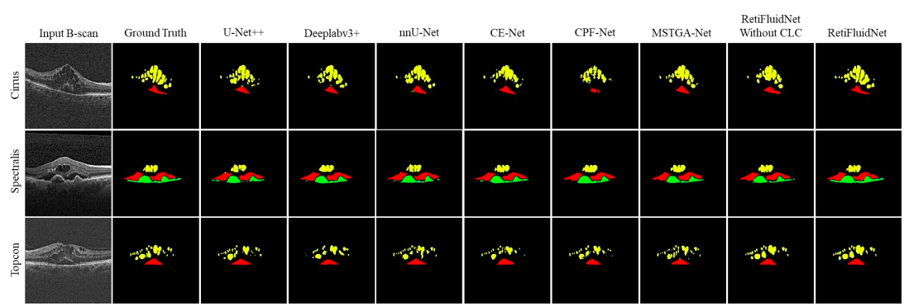

# RetiFluidNet
Official Tensorflow Implementation of "A Self-Adaptive and Multi-Attention Deep Convolutional Network for Retinal OCT Fluid Segmentation".[Paper](https://ieeexplore.ieee.org/abstract/document/9980422) 


  


## Other Implementations
- [[Tensorflow]](https://github.com/aidialab/RetiFluidNet) by AidiaLAB.


## Getting Started ###
### Installation
- Clone this repo:
```bash
git clone -b master --single-branch https://github.com/arminbiglari/RetiFluidNet.git
cd RetiFluidNet
```
- Install Tensorflow and dependencies


### Train
- To train the model, Please adjust the params.yaml file based on your dataset.
```bash
python3 train.py
```
### Test
- To Test the model, Please adjust the params.yaml file based on your dataset.
```bash
python3 test.py
```

### Pre-trined Weights
- To access pre-traiend models please contact arminbiglariii@gmail.com


### Citation

If you find this useful for your research, please use the following.

```
@ARTICLE{9980422,
  author={Rasti, Reza and Biglari, Armin and Rezapourian, Mohammad and Yang, Ziyun and Farsiu, Sina},
  journal={IEEE Transactions on Medical Imaging}, 
  title={RetiFluidNet: A Self-Adaptive and Multi-Attention Deep Convolutional Network for Retinal OCT Fluid Segmentation}, 
  year={2023},
  volume={42},
  number={5},
  pages={1413-1423},
  keywords={Fluids;Retina;Image segmentation;Visualization;Task analysis;Optimization;Lesions;Medical image segmentation;convolutional neural network;retinal disease;fluid segmentation},
  doi={10.1109/TMI.2022.3228285}}


